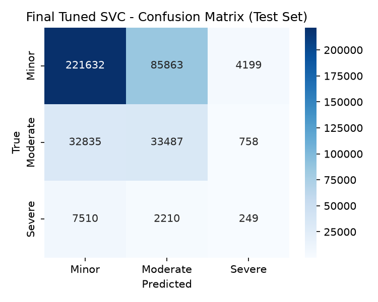

# Final Model Evaluation

Final tuned SVC (`models/final_svc.joblib`), evaluated on the held-out test set
(388743 rows).

## Model comparison (test set, all four trained/evaluated the same way)

| Variant | Accuracy | Macro-F1 | Minor Recall | Moderate Recall | Severe Recall |
|---|---|---|---|---|---|
| Baseline (no balancing) | 0.802 | 0.297 | 1.000 | 0.000 | 0.000 |
| SMOTENC-balanced | 0.374 | 0.291 | 0.299 | 0.732 | 0.296 |
| Tuned (Optuna) | 0.657 | 0.387 | 0.711 | 0.499 | 0.025 |
| LightGBM (class-weighted) | 0.550 | 0.442 | 0.496 | 0.759 | 0.824 |

Severe-class recall goes from 0.0% (baseline) to
29.6% (SMOTENC) to 2.5% (tuned): Optuna
optimizes mean macro-F1 across CV folds, which favors getting Minor and Moderate
right and trades away most of SMOTENC's Severe-recall gain to do it.

LightGBM (`models/final_lgbm.joblib`), trained on the full training split with
`class_weight="balanced"` instead of SMOTENC, beats every SVC variant on macro-F1
(0.442) and Severe recall (82.4%) at once --
both the scaling fix (no subsampling) and the tree model's better fit on this
mixed categorical/continuous data show up directly in the numbers.

## Final (tuned) model -- per-class metrics

| Class | Precision | Recall | F1 | Support |
|---|---|---|---|---|
| Minor | 0.846 | 0.711 | 0.773 | 311694 |
| Moderate | 0.275 | 0.499 | 0.355 | 67080 |
| Severe | 0.048 | 0.025 | 0.033 | 9969 |

## Confusion matrix

